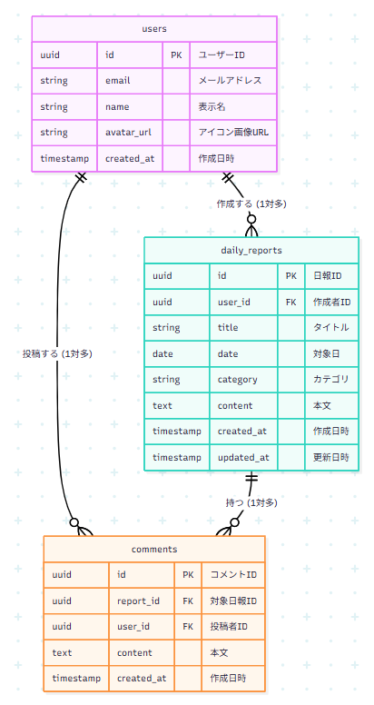
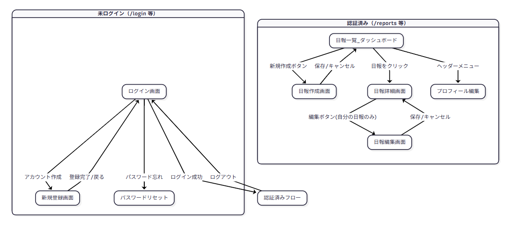

# チーム日報管理システム

- Team Activity Log (アプリケーション名)

## 概要

- 企業・チームで使用する日報管理システム。メンバーが日々の業務内容を記録し、チーム内で共有・コメントし合うことで、業務の可視化とコミュニケーションの活性化を図るアプリケーションです。
  シンプルなUIを採用し、エンジニアやビジネスチームが毎日の入力にストレスを感じない「実用性」と「読みやすさ」にこだわって開発しています。

## ターゲット層・解決する課題

###ターゲットユーザー

- 中小企業のチームリーダー・マネージャー
- リモートワークチームのメンバー

### 解決する課題

- 日報を紙やExcelでの管理からWebでの一元管理へ移行する。
- 現在、個人で管理しているタスクをチーム内で可視化・共有し、業務の属人化を防ぐ。
- 初対面、ネットワーク越しのメンバー同士でもコミュニケーションの活性化を図る。
- 日報へのフィードバックが遅い課題を、コメント機能で迅速化する。

## 使用技術（Tech Stack）

### 1. フロントエンド

- Next.js 16 (App Router)
- TypeScript（バグを防ぐための厳格な型定義）
- Tailwind CSS + shadcn/ui
- PC・スマホで表示可能

### 2. バックエンド

- Supabase（データの保存）
- PostgreSQL（Supabaseの裏側で動いているデータベース）
- Supabase Auth（認証）
- RLS (Row Level Security)
    - `daily_reports`：全員が全件閲覧可能・自分の日報のみ作成・編集・削除可能
    - `comments`：全員が全件閲覧可能・自分のコメントのみ作成・削除可能

### 3. インフラ・CI/CD

- Vercel（ホスティング環境）
- GitHub（バージョン管理）
- GitHub Actions（CI/CD）

### 4. テストコード

- Vitest (Unit Test)
- Playwright (E2E Test)

### 5. その他

- DiceBear API (アバター自動生成)

## 主な機能（Features）

- **認証システム**:
    - メールアドレス / パスワードによるサインアップ・ログイン
    - パスワードリセット機能
- **活動記録（日報）管理機能**:
    - 日報の作成
    - 日報の編集（自分が作成した日報のみ編集可能）
    - 日報の削除（自分が作成した日報のみ削除可能）
    - カテゴリ選択（開発、会議、営業、その他）
    - 日報一覧表示（ページネーション対応）
- **コミュニケーション機能**:
    - 日報へのコメント投稿機能
- **ユーザー管理**:
    - プロフィール編集（ユーザー名）
    - 名前からの一意なアバター画像自動生成
      _(※) 画像アップロード機能を省き、外部API（DiceBear）によるSVG画像の自動生成を採用。_

## データベース設計（ER図）

## 画面設計（画面遷移図）

